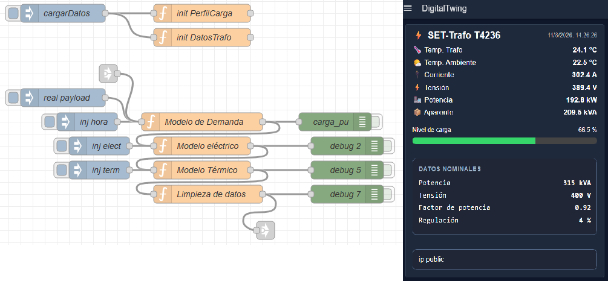
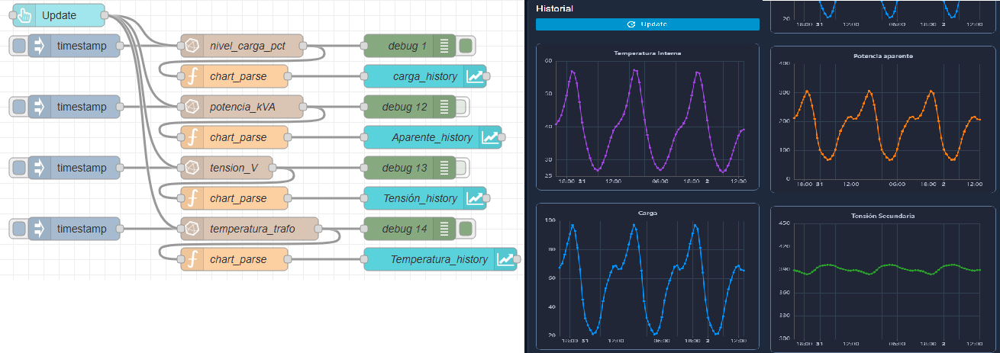
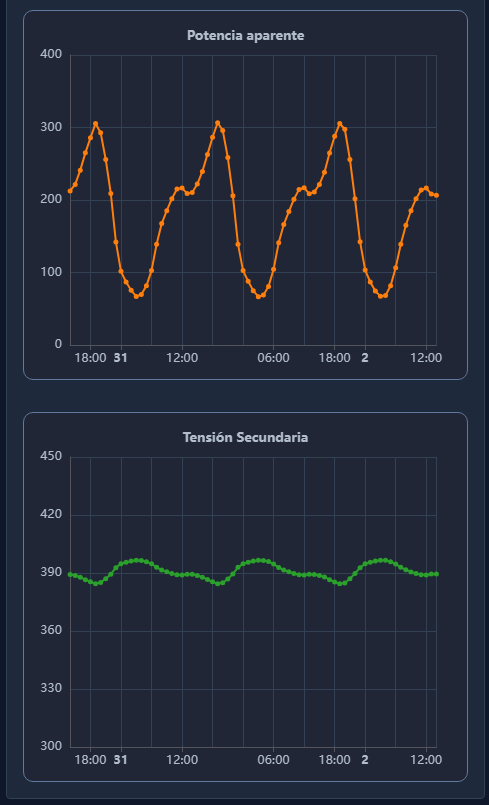

# Industrial Transformer Digital Twin

## Overview

Development of a simplified, physics-based digital twin for a three-phase distribution transformer.

The project was developed as a way to generate representative electrical and thermal data for a transformer in the absence of a sufficiently large real-world dataset. The generated data was intended to provide a basis for developing and testing predictive models for transformer operating conditions and potential failure or risk detection.

The system combines real environmental measurements from a physical sensor node with engineering-based models to estimate the electrical and thermal behavior of a transformer that is not directly instrumented.

The digital twin was implemented using Node-RED as the processing and integration environment, with InfluxDB for time-series storage and Node-RED Dashboard 2.0 for real-time visualization and historical analysis.

This project sits in the middle of a broader portfolio pipeline: it consumes real field telemetry from **02 — Low-Power LoRa Sensor Node**, and it exists specifically because **04 — Time-Series Machine Learning** ran into a data-scarcity wall — see [Related Projects](#related-projects) below.

```
Physical sensing (02) → Telemetry (MQTT) → Digital modeling (this project) → Time-series analysis / ML (04)
```

<p align="center">
  
</p>

<p align="center">
  <i>Node-RED implementation of the model (left) and the resulting real-time dashboard (right).</i>
</p>

---

## System Architecture

```text
                    Physical Sensor Node
                            │
                            │ LoRa
                            ▼
                     Dragino Gateway
                            │
                            │ MQTT
                            ▼
                        Node-RED
                            │
              ┌─────────────┴─────────────┐
              │                           │
              ▼                           ▼
       Digital Twin Models            InfluxDB
              │                           │
              │                           ▼
              │                    Historical Data
              │
              ▼
          Dashboard
```
The physical sensor node provides environmental measurements such as ambient temperature and timestamp.

Node-RED processes these measurements together with the transformer parameters and a time-based load profile. The resulting electrical and thermal variables are stored in InfluxDB and presented through the dashboard.

> **Scope note:** this repository contains the modeling flow (`flows/model.json`) and the historical dashboard/storage flow (`flows/historic.json`). The MQTT subscription/parsing step that bridges the Dragino gateway to the model — represented by the `data_in` link-node in `model.json` — lives in a separate Node-RED tab that is not part of this export.

## Digital Twin Model

The digital twin is organized into three main stages:
```text
                    Time of Day
                         │
                         ▼
                   Load Profile
                         │
                         ▼
                  Demand Model
                         │
                         ▼
                 Electrical Model
                    │    │    │
                    │    │    └── Active Power
                    │    └─────── Apparent Power
                    └──────────── Current / Voltage
                         │
                         ▼
                    Thermal Model
                         │
                         ▼
                Transformer Temperature
```
The model separates the transformer parameters from the calculation logic, allowing the same model structure to be adapted to different transformer ratings.

## 1. Load Demand Model

Transformer loading is estimated as a function of the time of day using a normalized daily load profile.

The profile is represented by discrete points and linearly interpolated between them, allowing the model to estimate the transformer load at any point during the day. The time of day is derived from the incoming sensor timestamp with explicit timezone handling (`America/Argentina/Buenos_Aires`), rather than relying on the server's local clock.

Example profile:

| Time  | Load |
| ----- | ---- |
| 00:00 | 35%  |
| 02:00 | 25%  |
| 04:00 | 20%  |
| 06:00 | 28%  |
| 08:00 | 50%  |
| 10:00 | 62%  |
| 12:00 | 70%  |
| 14:00 | 65%  |
| 16:00 | 72%  |
| 18:00 | 88%  |
| 20:00 | 100% |
| 22:00 | 75%  |
| 24:00 | 35%  |

The model receives the current time and returns the normalized transformer loading:
```text
load_pu
```

## 2. Transformer Parameters

The model stores the transformer characteristics separately from the processing logic.

The prototype configuration uses:
```text
Rated power:         315 kVA
Secondary voltage:   400 V
Power factor:        0.92
Voltage regulation:  4 %
Maximum temperature rise: 45 °C
Thermal time constant:    180 min
```
Separating these parameters from the model allows the same calculation logic to be reused with different transformer configurations.

## 3. Electrical Model

The electrical model converts the estimated transformer loading into operating variables.

The nominal current is calculated from the rated apparent power and secondary voltage:

```text
In = Sn / (√3 × Vn)
```

For a 315 kVA, 400 V transformer:

```text
In ≈ 454.7 A
```

The estimated operating variables are then calculated from the normalized load:

```text
I = load_pu × In

S = load_pu × Sn

P = S × PF
```

A simplified voltage regulation model is also used to represent the voltage drop as the transformer loading increases:

```text
V = Vn × (1 − Reg × load_pu)
```

The electrical model therefore provides:

- Estimated current
- Secondary voltage
- Apparent power
- Active power
- Transformer loading

---

## 4. Thermal Model

The thermal model estimates transformer temperature from ambient temperature and transformer loading.

The temperature rise is related to the normalized current:

```text
ΔT = ΔTmax × (I / In)²
```

The resulting target temperature is:

```text
Ttarget = Tamb + ΔT
```

Unlike the electrical variables, transformer temperature is not treated as an instantaneous value.

A first-order discrete model is used to represent the thermal inertia of the transformer:

```text
Tn = Tn-1 + K × (Ttarget − Tn-1)
```

The coefficient `K` is derived from the transformer thermal time constant and the sampling interval:

```text
K = 1 − e^(-dt / τ)
```

For the implemented model:

```text
dt = 15 min
τ  = 180 min
```

This produces a gradual temperature response as the estimated load changes, rather than an instantaneous temperature jump.

The model represents a simplified equivalent transformer temperature suitable for the digital twin rather than a detailed winding-level thermal simulation.

---

## Data Processing

After the electrical and thermal calculations, the processed data is normalized into a common structure containing:

```text
Timestamp
Ambient temperature
Transformer temperature
Load level
Current
Voltage
Apparent power
Active power
```

The resulting data is used both for real-time visualization and historical storage.

---

## Time-Series Storage

Transformer data is stored in InfluxDB using the measurement:

```text
dt_transformador
```

The stored variables include:

- Ambient temperature
- Transformer temperature
- Load level
- Current
- Voltage
- Apparent power
- Active power

Historical data can be queried and aggregated over time to generate hourly trends for the main transformer variables.

<p align="center">
  
</p>

<p align="center">
  <i>Historical transformer data retrieved from InfluxDB.</i>
</p>

---

## Dashboard

A custom Node-RED Dashboard 2.0 interface was developed to provide a real-time view of the transformer state.

The interface displays:

- Transformer temperature
- Ambient temperature
- Current
- Secondary voltage
- Active power
- Apparent power
- Load percentage
- Transformer nominal parameters

Historical charts provide additional visualization of transformer behavior over time: internal temperature and load level follow the expected daily cycle driven by the load profile, apparent power tracks load directly, and secondary voltage stays within a narrow band as the voltage-regulation model responds to load changes.

<p align="center">
  
  
</p>

---

## Node-RED Implementation

The complete processing pipeline was implemented using Node-RED Function nodes and dashboard components.

The main processing stages are:

```text
Input Data
    │
    ▼
Load Profile
    │
    ▼
Demand Model
    │
    ▼
Electrical Model
    │
    ▼
Thermal Model
    │
    ▼
Data Processing
    │
    ├──────────────► Dashboard
    │
    └──────────────► InfluxDB
```

---

## Technologies

**Data acquisition:** LoRa · MQTT

**Processing & integration:** Node-RED

**Time-series database:** InfluxDB

**Visualization:** Node-RED Dashboard 2.0

**Modeling:** Load profile interpolation · Electrical modeling · First-order thermal model

**Hardware integration:** STM32 · ESP32 · Dragino Gateway

---

## Project Structure

```text
01-Industrial-Transformer-Digital-Twin/
│
├── README.md
│
├── flows/
│   ├── model.json        # Load profile, electrical model, thermal model (calculation logic)
│   └── historic.json     # InfluxDB queries, historical charts, dashboard wiring
│
└── docs/
    └── images/
        ├── flow-dash01.png   # Node-RED flow (model.json) + live dashboard
        ├── flow-dash02.png   # Node-RED flow (historic.json) + historical charts
        ├── dash02.png        # Historical charts: temperature & load (dashboard only)
        └── dash03.png        # Historical charts: apparent power & voltage (dashboard only)
```

---

## Known Limitations / Scope Notes

- The MQTT ingestion flow that subscribes to the Dragino gateway and feeds `model.json` (via its `data_in` link-in node) is not included in this repository — only the modeling and historical/dashboard flows are exported here.
- The transformer's rated temperature (`temp_nominal`) is defined in the parameter set but not currently used by the thermal model.
- This is a simplified, lumped-parameter model (single equivalent temperature, no per-winding detail) — intended to produce representative data for downstream analysis, not a certified thermal simulation.

---

## Related Projects

This project is the modeling link in a larger pipeline:

- [**02 — Low-Power LoRa Sensor Node**](https://github.com/maxiexe97/02-Low-Power-LoRa-Sensor-Node) — supplies the real environmental measurements (ambient temperature, timestamp) this digital twin uses as input. The test payload used during development of the model flow (`{"timestamp":...,"rssi":...,"vbat":...,"t":...,"h":...,"c":...}`) matches that project's sensor payload format directly.
- [**04 — Time-Series Machine Learning**](https://github.com/maxiexe97/04-Time-Series-Machine-Learning) — this digital twin exists largely because of that project: real transformer/electrical telemetry (`SmartSET004`, ~10 days of data) turned out to be too short to train a useful forecasting model. Generating a larger, representative synthetic dataset here is the intended path to revisiting that forecasting work with enough history to matter.

```
Physical Sensor (02)
      │
      ▼
     LoRa
      │
      ▼
   Gateway
      │
      ▼
     MQTT
      │
      ▼
   Node-RED
      │
      ▼
 Digital Twin (this project)
      │
      ├────────► InfluxDB
      │
      └────────► Dashboard
      │
      ▼
 Time-Series ML (04)
```

The physical sensor provides real measurements, while the digital twin uses these measurements as inputs to estimate variables that are not directly measured on the transformer — producing the volume of representative data that the real-data experiment in project 04 lacked.

---

## Key Engineering Concepts

- Embedded sensor data integration
- MQTT-based telemetry
- Time-series data processing
- Load profile modeling
- Electrical parameter estimation
- Transformer voltage regulation modeling
- Thermal inertia modeling
- State-based simulation
- Real-time monitoring
- Historical data analysis
- Node-RED flow-based system integration
